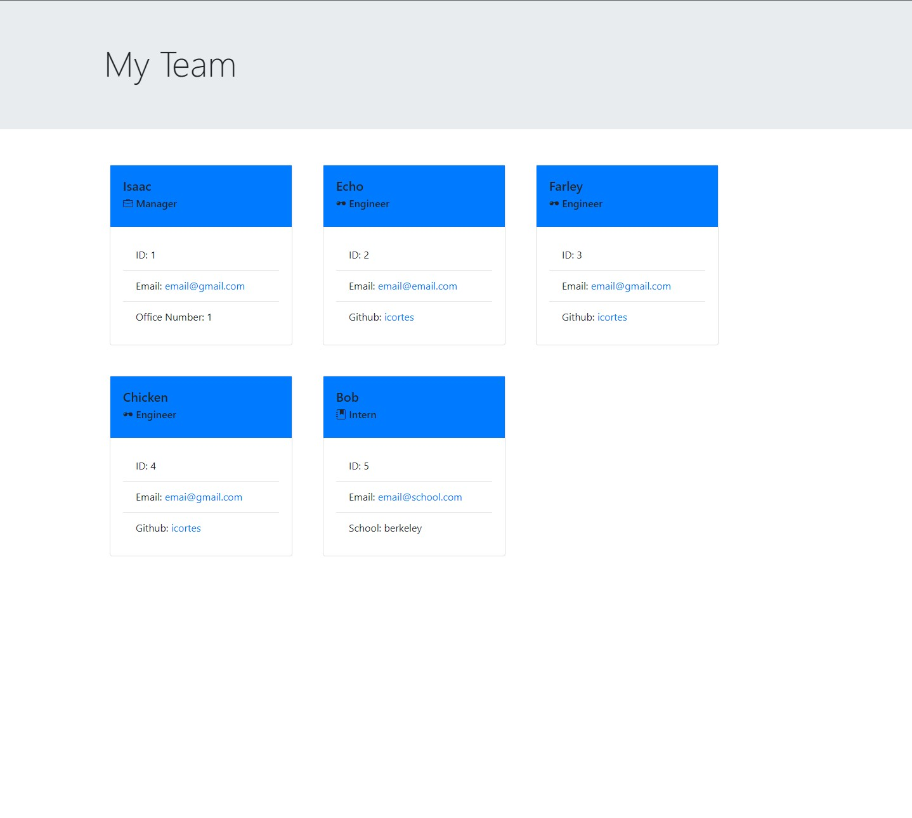
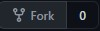

# Team Profile Generator

This application takes in information about employees on a software engineering team, then generates a webpage that displays summaries for each person.



## Getting Started

These instructions will get you a copy of the project up and running on your local machine for development and testing purposes.

### Prerequisites

Please have these installed before continuing:

* [Git](https://git-scm.com/downloads)
* [Node.js](https://nodejs.org/en/download/)

You will also need a github account. Get one [here](https://github.com/).

### Installing

1. Fork the project to your account.

    

2. Click the green code button and copy the SSH url. Should look like this:
    ```
    git@github.com:<username>/team-profile-generator.git
    ```
3. Open Git bash terminal and navigate to your desktop.
    ```
    cd Desktop
    ```
4. Clone the repository to your desktop. You can right click on the terminal to paste the SSH url.
    ```
    git clone git@github.com:<username>/team-profile-generator.git
    ```
5. Navigate to the repository and into develop folder.
    ```
    cd professional-readme-generator/develop/
    ```
6. Download and install inquirer to run the application and jest to run tests.
    ```
    npm install
    ```

### Usage

1. Now that all the dependencies are installed, to run the program write in terminal:

        npm start

2. Answer the prompts. A new html file will be created in /dist/:

        The file has been written!

3. Navigate to /dist/.

        cd dist/

4. Open explorer to see your file.
        
        explorer .

    Click [here](https://watch.screencastify.com/v/hbvccUshL2HWqvNZuqfc) to see the app in action.

### Test

To test, run the command <code>npm test</code> in terminal.

## Built With

* [HTML](https://developer.mozilla.org/en-US/docs/Web/HTML)
* [CSS](https://developer.mozilla.org/en-US/docs/Web/CSS)
* [Javascript](https://developer.mozilla.org/en-US/docs/Web/JavaScript)

## Authors

* **Isaac Cortes Hernandez** 

- [Link to Portfolio Site](https://icortes.github.io/my-first-portfolio/)
- [Link to Github](https://github.com/icortes)
- [Link to LinkedIn](https://www.linkedin.com/in/cortes-isaac)

## License

This project is licensed under the MIT License 

## Acknowledgments

* Node.js documentation
* inquirer documentation
